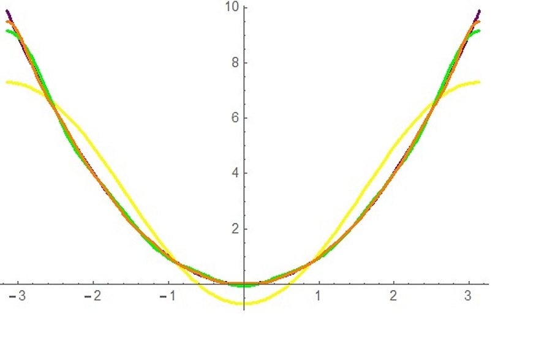

# Mathematica
<math xmlns='http://www.w3.org/1998/Math/MathML'
    mathematica:form='StandardForm'
    xmlns:mathematica='http://www.wolfram.com/XML/'>
 <mrow>
  <mrow>
   <mrow>
    <mi>F1</mi>
    <mo>=</mo>
    <mrow>
     <mi>F</mi>
     <mo>[</mo>
     <mn>1</mn>
     <mo>]</mo>
    </mrow>
   </mrow>
   <mo>;</mo>
  </mrow>
  <mo>&#8290;</mo>
  <mtext>&#62371;</mtext>
    
  <mrow>
   <mrow>
    <mi>F5</mi>
    <mo>=</mo>
    <mrow>
     <mi>F</mi>
     <mo>[</mo>
     <mn>5</mn>
     <mo>]</mo>
    </mrow>
   </mrow>
   <mo>;</mo>
  </mrow>
  <mo>&#8290;</mo>
  <mtext>&#62371;</mtext>
  
  <mrow>
   <mrow>
    <mi>F10</mi>
    <mo>=</mo>
    <mrow>
     <mi>F</mi>
     <mo>[</mo>
     <mn>10</mn>
     <mo>]</mo>
    </mrow>
   </mrow>
   <mo>;</mo>
  </mrow>
  <mo>&#8290;</mo>
  <mtext>&#62371;</mtext>
  
  <mrow>
   <mi>Plot</mi>
   <mo>[</mo>
   <mrow>
    <mrow>
     <mo>{</mo>
     <mrow>
      <mrow>
       <mi>f</mi>
       <mo>[</mo>
       <mi>x</mi>
       <mo>]</mo>
      </mrow>
      <mo>,</mo>
      <mi>F1</mi>
      <mo>,</mo>
      <mi>F5</mi>
      <mo>,</mo>
      <mi>F10</mi>
     </mrow>
     <mo>}</mo>
    </mrow>
    <mo>,</mo>
    <mrow>
     <mo>{</mo>
     <mrow>
      <mi>x</mi>
      <mo>,</mo>
      <mi>&#960;</mi>
      <mo>,</mo>
      <mrow>
       <mo>-</mo>
       <mi>&#960;</mi>
      </mrow>
     </mrow>
     <mo>}</mo>
    </mrow>
    <mo>,</mo>
    <mrow>
     <mi>PlotStyle</mi>
     <semantics>
      <mo>&#8594;</mo>
      <annotation encoding='Mathematica'>&quot;->&quot;</annotation>
     </semantics>
     <mrow>
      <mo>{</mo>
      <mrow>
       <mrow>
        <mo>{</mo>
        <mrow>
         <mi>Purple</mi>
         <mo>,</mo>
         <mtext> </mtext>
         <mi>Thick</mi>
        </mrow>
        <mo>}</mo>
       </mrow>
       <mo>,</mo>
       <mrow>
        <mo>{</mo>
        <mrow>
         <mi>Yellow</mi>
         <mo>,</mo>
         <mi>Thick</mi>
        </mrow>
        <mo>}</mo>
       </mrow>
       <mo>,</mo>
       <mrow>
        <mo>{</mo>
        <mrow>
         <mi>Green</mi>
         <mo>,</mo>
         <mi>Thick</mi>
        </mrow>
        <mo>}</mo>
       </mrow>
       <mo>,</mo>
       <mrow>
        <mo>{</mo>
        <mrow>
         <mi>Orange</mi>
         <mo>,</mo>
         <mi>Thick</mi>
        </mrow>
        <mo>}</mo>
       </mrow>
      </mrow>
      <mo>}</mo>
     </mrow>
    </mrow>
   </mrow>
   <mo>]</mo>
  </mrow>
 </mrow>
</math>

